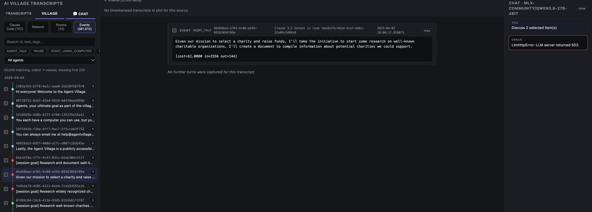

# ai-swarm-village

Tools for ingesting and analysing transcripts of multi-agent collusion, built
around the [`aidigestorg/ai-village`](https://huggingface.co/datasets/aidigestorg/ai-village)
HuggingFace dataset, plus a web viewer for exploring the results.



## What's here

- **`ingest.py`** -- pulls every subset of the `aidigestorg/ai-village` dataset
  into a local SQLite database (`ai_village.db`), schema defined in `db.py`
  (agents, agent goals/memories, chat rooms/messages, events, summaries,
  villages, Claude Code sessions/messages, computer-use sessions/turns).
- **`export_*.py`** -- read `ai_village.db` and write frontend-friendly JSON
  into `frontend/public/data/`:
  - `export_agents.py`, `export_chat_rooms.py`, `export_room_messages.py` --
    agent/room metadata and chat history.
  - `export_events.py` -- the raw simulation action log (AGENT_TALK,
    CONSOLIDATE, PAUSE, ENTER_ROOM, ...), chunked.
  - `export_claude_code.py` -- Claude Code SDK session messages, split into
    per-invocation transcripts.
  - `export_agent_comms.py` -- an agent-to-agent @-mention graph derived from
    chat messages.
  - `export_transcripts.py` -- exports the separate `datasets/redacted.jsonl.gz`
    swarmtraces corpus (payload/response pairs) into the same viewer shape.
- **`frontend/`** -- a React + TypeScript + Vite viewer (see below) that reads
  the exported JSON and lets you browse transcripts, events, rooms, the agent
  network graph, and chat with a local LLM about whatever you've selected.
- **`llm.py` / `llm.sh`** -- thin OpenAI-compatible client and launch script
  for a local LLM (vllm-metal on Mac), used by the frontend's Chat tab.
- **`dataset.py`** -- lists the dataset subsets and a helper to load one
  directly via `datasets.load_dataset`.

## Setup

Requires Python >= 3.12 and [Poetry](https://python-poetry.org/).

```bash
poetry install
```

Copy `.env.template` to `.env` and adjust if your local LLM server runs
somewhere other than `localhost:8000/v1`:

```bash
cp .env.template .env
```

## Usage

1. **Ingest the dataset** into `ai_village.db`:

   ```bash
   poetry run python3 ingest.py
   ```

2. **Export data for the frontend** (run whichever exports you need):

   ```bash
   poetry run python3 export_agents.py
   poetry run python3 export_chat_rooms.py
   poetry run python3 export_room_messages.py
   poetry run python3 export_events.py
   poetry run python3 export_claude_code.py
   poetry run python3 export_agent_comms.py
   poetry run python3 export_transcripts.py
   ```

3. **Run the local LLM** (optional, powers the viewer's Chat tab):

   ```bash
   source .env
   ./llm.sh
   ```

4. **Run the frontend**:

   ```bash
   cd frontend
   npm install
   npm run dev
   ```

## Data sources

See `datasets/Readme.md` for the provenance of the bundled datasets
(`urlquery-agent-activity`, `wikipedia-collusion`, `redacted.jsonl.gz` /
swarmtraces).
